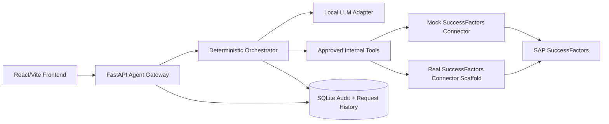
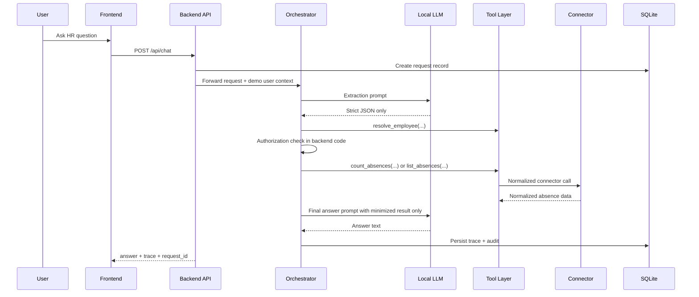

# Architecture

## System Overview

## Request Flow

## Security Boundary Notes

- The model never receives SAP credentials.
- The model never selects arbitrary tools or raw SAP queries.
- Authorization happens after employee resolution and before absence retrieval.
- The answer-generation prompt receives only minimized normalized data.
- `RealSuccessFactorsConnector` is scaffolded with explicit TODO markers for production-grade OData filtering and normalization.
